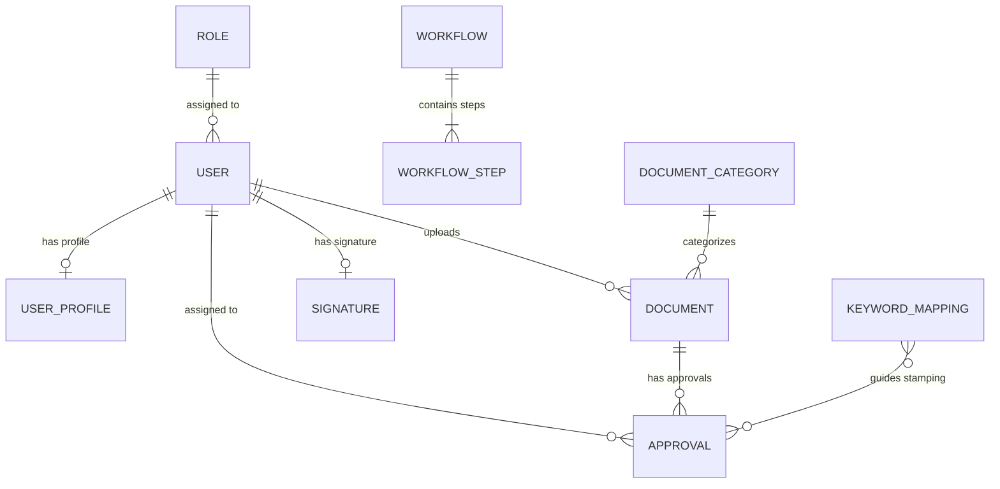
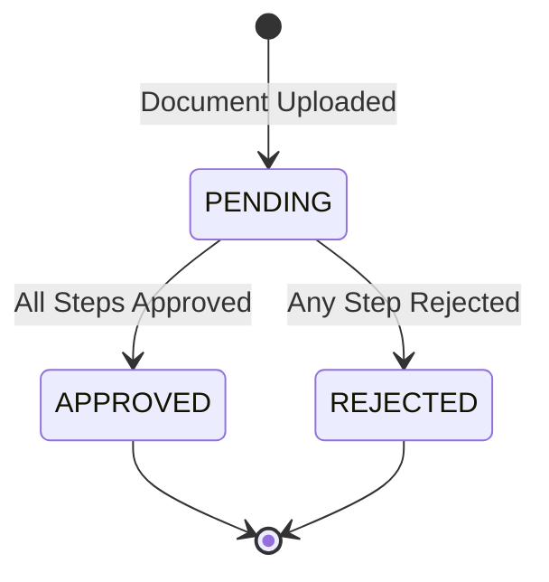
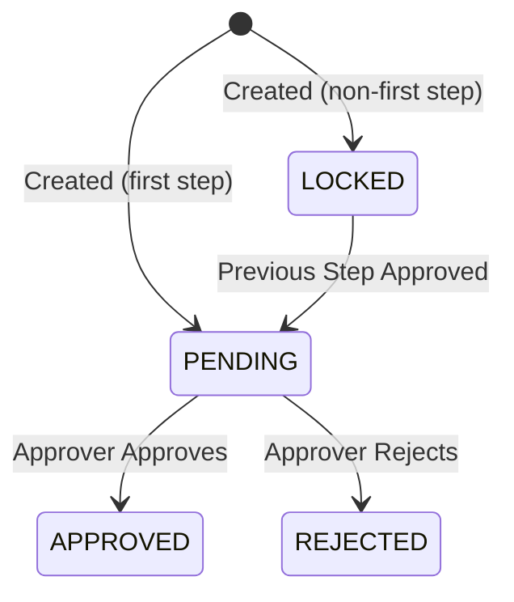

# 📋 Product Specification Document

**DMS — Document Management System**
**Version:** 1.1.0
**Date:** March 10, 2026
**Organization:** Astara Hotel & Pentacity Hotel

---

## Table of Contents

1. [Product Overview](#1-product-overview)
2. [System Architecture](#2-system-architecture)
3. [Technology Stack](#3-technology-stack)
4. [Data Model](#4-data-model)
5. [Core Modules](#5-core-modules)
6. [User Roles & Permissions](#6-user-roles--permissions)
7. [User Interface Specification](#7-user-interface-specification)
8. [API Specification](#8-api-specification)
9. [Security Specification](#9-security-specification)
10. [File Storage Specification](#10-file-storage-specification)
11. [Business Rules & Constraints](#11-business-rules--constraints)
12. [Non-Functional Requirements](#12-non-functional-requirements)
13. [Glossary](#13-glossary)

---

## 1. Product Overview

### 1.1 Purpose

DMS (Document Management System) is an internal web application designed to digitize the document approval workflow for hotel operations across **Astara Hotel** and **Pentacity Hotel**. It replaces the manual, paper-based document routing process with a streamlined digital platform featuring multi-step approval chains and automatic digital signature stamping on PDF documents.

### 1.2 Problem Statement

Hotel operations involve daily processing of Purchase Orders, Cash Advances, Petty Cash vouchers, and Memos — all requiring multi-level management approval. The legacy paper-based process suffers from:

- **Document loss** — Physical documents get misplaced during routing
- **Approval delays** — Unavailable signatories stall the entire pipeline
- **No traceability** — Difficult to track which stage a document is at
- **No audit trail** — No verifiable record of who approved what and when

### 1.3 Solution

DMS addresses these through:

| Capability | Description |
|-----------|-------------|
| **Digital Upload & Storage** | PDF documents are uploaded, categorized, and stored in an organized file system |
| **Multi-Step Approval Workflow** | Configurable, sequential approval chains per document category and branch |
| **Auto Signature Stamping** | Automatic PNG signature placement on PDFs upon approval, positioned by keyword detection |
| **Absence Delegation** | Seamless re-routing of approvals when an approver is unavailable |
| **Role-Based Access Control** | Granular permissions per user role ensuring data and action security |

### 1.4 Scope

| In Scope | Out of Scope |
|----------|-------------|
| PDF document management lifecycle | Non-PDF file types |
| Multi-step approval workflow engine | Electronic signature (e-sign) with certificates |
| PNG signature auto-stamping on PDF | Email/push notification delivery |
| Absence delegation management | Mobile native application |
| Admin panel for configuration | Integration with ERP / accounting systems |
| Two branches: Astara & Pentacity | Multi-tenant SaaS deployment |

### 1.5 Supported Document Categories

| Code | Category | Display ID Pattern | Example |
|------|----------|--------------------|---------|
| `PO` | Purchase Order | `PO-YYYY-NNNN` | `PO-2026-0042` |
| `CA` | Cash Advance | `CA-YYYY-NNNN` | `CA-2026-0015` |
| `PC` | Petty Cash | `PC-YYYY-NNNN` | `PC-2026-0008` |
| `MM` | Memo | `MM-YYYY-NNNN` | `MM-2026-0003` |

---

## 2. System Architecture

### 2.1 High-Level Architecture
```
┌──────────────────────────┐      ┌──────────────────────────────┐
│    Frontend (SPA)        │      │    Backend (API Server)       │
│    React 19 + Vite 7     │─────▶│    Express.js 4.21            │
│    Build → dist/          │ HTTP │    Port: 3001 (Bound: 0.0.0.0)│
│    React Router v7       │      │    Drizzle ORM 0.40           │
│    Lucide React Icons    │      │    Better Auth 1.1            │
└──────────────────────────┘      │    Multer 1.4 (File Upload)   │
                                  │    Python (PyMuPDF)            │
                                  │    PDF Signature Stamping      │
                                  └───────────────────────────────┘
```

### 2.2 Monorepo Structure

```
DMS/                          (npm workspaces root)
├── packages/
│   ├── server/               (Backend — Express + Drizzle + Better Auth)
│   └── web/                  (Frontend — React + Vite SPA)
└── docs/                     (Project documentation)
```

### 2.3 Communication Pattern

- **Frontend → Backend:** RESTful API calls over HTTP with `credentials: include` for cookie-based session auth
- **Backend → Database:** Drizzle ORM queries over `node-postgres` driver
- **Backend → File System:** `multer` for uploads, `fs` for file I/O
- **Backend → Python:** Child process execution of `stamp_pdf.py` script for PDF signature stamping

---

## 3. Technology Stack

### 3.1 Frontend

| Technology | Version | Purpose |
|-----------|---------|---------|
| React | 19.2 | UI component framework |
| Vite | 7.3 | Build tool & dev server |
| React Router | 7.13 | Client-side routing |
| Lucide React | 0.575 | Icon library |
| CSS (Vanilla) | — | Styling (per-component CSS files) |

### 3.2 Backend

| Technology | Version | Purpose |
|-----------|---------|---------|
| Node.js | ≥ 20 | Runtime environment |
| Express.js | 4.21 | HTTP web framework |
| Drizzle ORM | 0.40 | Type-safe SQL query builder / ORM |
| Better Auth | 1.1 | Authentication (email/password, session cookies) |
| Multer | 1.4 | Multipart file upload handler |
| Helmet | 8.0 | HTTP security headers |
| pg (node-postgres) | 8.13 | PostgreSQL database driver |

### 3.3 Database

| Technology | Purpose |
|-----------|---------|
| PostgreSQL | Primary relational database |

### 3.4 External Tools

| Technology | Purpose |
|-----------|---------|
| Python 3 + PyMuPDF | PDF manipulation for signature stamping |

---

## 4. Data Model

### 4.1 Entity Relationship Diagram



### 4.2 Core Tables

#### Authentication Tables (Better Auth)

| Table | Description | Key Columns |
|-------|-------------|-------------|
| `user` | User accounts | `id`, `name`, `email`, `role`, `banned` |
| `session` | Active login sessions | `token`, `expires_at`, `user_id` |
| `account` | Auth provider credentials | `user_id`, `password` (hashed) |
| `verification` | Email verification tokens | `identifier`, `value`, `expires_at` |

#### Business Tables

| Table | Description | Key Columns |
|-------|-------------|-------------|
| `role` | Role definitions | `id` (e.g. `cost_control`), `name` |
| `document_category` | Document category definitions | `id` (e.g. `PO`), `name` |
| `user_profile` | Extended user data | `user_id`, `branch`, `is_absent`, `delegated_to_user_id` |
| `document` | Uploaded documents | `display_id`, `category`, `branch`, `file_path`, `signed_file_path`, `status` |
| `workflow` | Workflow definitions | `category`, `branch` |
| `workflow_step` | Steps within a workflow | `workflow_id`, `step_order`, `role_required`, `is_optional` |
| `approval` | Approval chain instances | `document_id`, `step_order`, `role_required`, `assigned_user_id`, `status` |
| `signature` | Digital signature images | `user_id`, `image_path` |
| `keyword_mapping` | Keyword → signature placement rules | `category`, `role`, `keyword`, `position_hint` |

### 4.3 Document Status Lifecycle



### 4.4 Approval Step Status Lifecycle



---

## 5. Core Modules

### 5.1 Document Management Module

**Purpose:** Handles document upload, storage, retrieval, and lifecycle tracking.

| Feature | Specification |
|---------|--------------|
| Accepted format | PDF only (`.pdf`) |
| Max file size | 25 MB |
| Required metadata | Category (PO/CA/PC/MM), Branch (Astara/Pentacity) |
| Optional metadata | Notes (free text for approvers) |
| Auto-generated ID | Pattern: `[CATEGORY_CODE]-[YEAR]-[SEQ_NUMBER]` |
| Initial status | `PENDING` |
| Storage location | `./storage/documents/pending/{Branch}/` |

**Upload Flow:**

1. User selects a PDF file (drag & drop or browse)
2. User classifies: Category + Branch + optional Notes
3. User reviews and submits
4. System generates unique Display ID
5. System stores file in `pending/` directory
6. System creates approval chain based on matching workflow configuration
7. First approval step activated (`PENDING`), others set to `LOCKED`

---

### 5.2 Approval Workflow Engine

**Purpose:** Manages the sequential, multi-step approval process for each document.

#### Workflow Configuration

- Workflows are defined per **Category + Branch** combination
- Each workflow contains ordered **steps**, each requiring a specific **role**
- Steps support an `is_optional` flag for flexible chains
- Admin users configure workflows via the admin panel

#### Approval Processing Rules

| Rule | Description |
|------|-------------|
| **Sequential execution** | Steps are processed in strict `step_order`. A step activates only after the previous step is approved |
| **Role-based assignment** | Each step requires a specific role; the system auto-assigns the user with that role in the document's branch |
| **Approve action** | Current step → `APPROVED`, next step → `PENDING` (unlocked), signature stamped on PDF |
| **Reject action** | Current step → `REJECTED`, entire document → `REJECTED`. All subsequent steps are cancelled |
| **Last step approved** | Document status → `APPROVED`, final signed PDF is generated |
| **Comments** | Approvers can add an optional comment when approving or rejecting |

#### Example Workflow: Purchase Order (PO)

```
Step 1: Cost Control       ──▶ "Diperiksa oleh" keyword
Step 2: Financial Controller ──▶ "Disetujui oleh" keyword  
Step 3: Hotel Manager       ──▶ "Diketahui oleh" keyword
Step 4: KIC                 ──▶ Final review
```

---

### 5.3 Auto-Signature Stamping Module

**Purpose:** Automatically places a PNG signature image onto the PDF document at a keyword-detected position when an approver approves.

#### Components

| Component | Description |
|-----------|-------------|
| **Signature Image** | PNG file (recommended: 300×100px, transparent background) uploaded by Admin per user |
| **Keyword Mapping** | Admin-defined rules: `Category + Role → Keyword + Position Hint` |
| **PDF Stamper** | Python script (`stamp_pdf.py`) using PyMuPDF to find keyword position and overlay signature |

#### Stamping Flow

1. Approver clicks "Approve & Sign"
2. System retrieves approver's signature PNG from `./storage/signatures/`
3. System looks up keyword mapping for `(document.category, step.role_required)`
4. Python script scans PDF text for the keyword
5. Signature PNG is placed near the keyword location
6. Output saved as `{DisplayId}_step{N}_signed.pdf`
7. `document.signed_file_path` updated to point to latest stamped version
8. Previous intermediate signed files are cleaned up

#### Signature Chaining

Each approval step builds on the previous signed output:

```
Original PDF → Step 1 signed → Step 2 signed → Step 3 signed → Final
```

---

### 5.4 Absence Delegation Module

**Purpose:** Ensures approval workflows are not blocked when an approver is unavailable.

#### Delegation Configuration (Admin)

| Field | Description |
|-------|-------------|
| `is_absent` | Marks a user as currently absent |
| `delegated_to_user_id` | The substitute user who receives delegated approvals |
| `absence_start_date` | When the absence begins |
| `absence_end_date` | Expected return date |

#### Delegation Logic

1. When a new approval step is activated, the system checks if the target approver has `is_absent = true`
2. If absent **and** a delegate is configured, the approval is re-assigned to the delegate
3. The `delegated_from_user_id` field records the original approver for audit
4. Delegated approvals appear in the delegate's "Delegated to Me" tab
5. Admin can mark a user as "Returned" to end the delegation

---

### 5.5 Administration Module

**Purpose:** Provides system configuration and user management capabilities exclusively to Admin users.

| Admin Feature | Description |
|---------------|-------------|
| **User Management** | Create users, assign roles & branches, ban/unban accounts |
| **Signature Management** | Upload/replace PNG signature images for approvers |
| **Workflow Configuration** | Define and edit approval chains per category + branch |
| **Keyword Configuration** | Map `Category + Role → Keyword` for signature placement |
| **Delegation Management** | Set/remove absence status and assign delegates |

> [!IMPORTANT]  
> Users cannot self-register. All accounts must be created by an Administrator.

---

## 6. User Roles & Permissions

### 6.1 Role Definitions

| Role ID | Display Name | Description |
|---------|-------------|-------------|
| `admin` | Administrator | Full system access including configuration panels |
| `initiator` | Initiator | Staff who initiate/upload documents |
| `purchasing` | Purchasing | Purchasing department staff (upload documents) |
| `cost_control` | Cost Control | First-level financial reviewer |
| `financial_controller` | Financial Controller | Senior financial reviewer |
| `hotel_manager` | Hotel Manager | Executive management reviewer |
| `kic` | KIC | Key Internal Control / final auditor |

### 6.2 Permission Matrix

| Feature | Admin | Initiator | Purchasing | Cost Control | Fin. Controller | Hotel Manager | KIC |
|--------|:-----:|:---------:|:----------:|:------------:|:---------------:|:-------------:|:---:|
| Dashboard | ✅ | ✅ | ✅ | ✅ | ✅ | ✅ | ✅ |
| View Documents | ✅ | ✅ | ✅ | ✅ | ✅ | ✅ | ✅ |
| Upload Documents | ✅ | ✅ | ✅ | ❌ | ❌ | ❌ | ❌ |
| Approve/Reject | ✅ | ❌ | ❌ | ✅ | ✅ | ✅ | ✅ |
| Manage Users | ✅ | ❌ | ❌ | ❌ | ❌ | ❌ | ❌ |
| Manage Signatures | ✅ | ❌ | ❌ | ❌ | ❌ | ❌ | ❌ |
| Configure Workflows | ✅ | ❌ | ❌ | ❌ | ❌ | ❌ | ❌ |
| Configure Keywords | ✅ | ❌ | ❌ | ❌ | ❌ | ❌ | ❌ |
| Manage Delegation | ✅ | ❌ | ❌ | ❌ | ❌ | ❌ | ❌ |
| Settings | ✅ | ✅ | ✅ | ✅ | ✅ | ✅ | ✅ |

---

## 7. User Interface Specification

### 7.1 Page Inventory

| Page | Route | Access | Description |
|------|-------|--------|-------------|
| Login | `/login` | Public | Email/password authentication |
| Dashboard | `/` | All authenticated | Statistics cards, recent docs, activity feed |
| Documents | `/documents` | All authenticated | Full document list with filters (category, status, view mode) |
| Document Detail | `/documents/:id` | All authenticated | PDF preview + document info + approval chain stepper |
| Upload | `/documents/upload` | Admin, Initiator, Purchasing | 3-step wizard (Upload → Classify → Review & Submit) |
| My Approvals | `/approvals` | Admin, Approver roles | Pending / Completed / Delegated tabs |
| Users | `/admin/users` | Admin only | User CRUD with search |
| Signatures | `/admin/signatures` | Admin only | Signature upload/replace per user (card grid) |
| Workflows | `/admin/workflows` | Admin only | Visual workflow chain editor per category |
| Keywords | `/admin/keywords` | Admin only | Keyword mapping table with CRUD |
| Delegation | `/admin/delegation` | Admin only | Absence cards with set/return controls |
| Categories | `/admin/categories` | Admin only | Document category management |
| Roles | `/admin/roles` | Admin only | Role management |
| Settings | `/settings` | All authenticated | Profile, notifications, display preferences |

### 7.2 Layout Structure

```
┌────────────────────────────────────────────────────────┐
│  Navbar (top)           [Branch Selector] [User Menu]  │
├──────────┬─────────────────────────────────────────────┤
│          │                                             │
│ Sidebar  │              Main Content Area              │
│ (left)   │                                             │
│          │                                             │
│ - Main   │                                             │
│ - Admin  │                                             │
│ - Account│                                             │
│          │                                             │
│ [«/»]    │                                             │
└──────────┴─────────────────────────────────────────────┘
```

- **Sidebar** is collapsible (`«`/`»` toggle)
- Navigation items are role-filtered
- **Branch Selector** at the top of sidebar allows switching between Astara and Pentacity

### 7.3 Document List Features

| Feature | Description |
|---------|-------------|
| Category Filter | Chip buttons: All, PO, CA, Petty Cash, Memo |
| Status Filter | Dropdown: All, PENDING, APPROVED, REJECTED |
| View Mode | Toggle between Table View (📋) and Grid View (🔲) |
| Sort Order | PENDING documents first, then APPROVED, then REJECTED (within each group: newest first) |
| Table Columns | Document (name + ID), Category (color badge), Branch, Date, Status (color badge), Uploader |
| Actions | Click document name to navigate to detail page |

### 7.4 Document Detail Layout

| Panel | Content |
|-------|---------|
| **Left (wide)** | PDF viewer with download button |
| **Right (sidebar)** | Document Info block + Approval Chain stepper |

**Approval Chain Stepper Icons:**

| Icon | Color | Meaning |
|------|-------|---------|
| ✅ | Green | Step completed (approved) |
| 🕐 | Yellow | Current step (awaiting action) |
| ❌ | Red | Step rejected |
| ⚪ | Gray | Step locked (not yet active) |

### 7.5 Upload Wizard Steps

| Step | Title | Fields |
|------|-------|--------|
| 1 | Upload File | Drag & drop zone / file browser (PDF only, max 25MB) |
| 2 | Classify Document | Category selector, Branch selector, Notes textarea |
| 3 | Review & Submit | Summary of all fields, workflow preview, Submit button |

---

## 8. API Specification

**Base URL:** `http://localhost:3001/api`

### 8.1 Authentication

| Method | Endpoint | Description |
|--------|----------|-------------|
| `*` | `/api/auth/*` | Better Auth handles sign-in, sign-up, session management |

### 8.2 Documents

| Method | Endpoint | Description | Auth |
|--------|----------|-------------|------|
| `GET` | `/api/documents` | List all documents (sorted: PENDING → APPROVED → REJECTED) | Required |
| `GET` | `/api/documents/:id` | Get document detail with approval chain | Required |
| `POST` | `/api/documents` | Upload new document (`multipart/form-data`) | Required (Initiator/Purchasing/Admin) |
| `DELETE` | `/api/documents/:id` | Delete document and its approval chain | Required (Admin only) |

### 8.3 Approvals

| Method | Endpoint | Description | Auth |
|--------|----------|-------------|------|
| `GET` | `/api/approvals/pending` | Get pending approvals for current user | Required (Approver roles) |
| `POST` | `/api/approvals/:id/action` | Submit approve/reject action | Required (Assigned approver) |

**Action Request Body:**
```json
{ "action": "approve" | "reject", "comment": "optional comment" }
```

### 8.4 Admin — Users

| Method | Endpoint | Description |
|--------|----------|-------------|
| `GET` | `/api/admin/users` | List all users |
| `POST` | `/api/admin/users` | Create new user |
| `POST` | `/api/admin/users/:id/delegation` | Set absence delegation |

### 8.5 Admin — Workflows

| Method | Endpoint | Description |
|--------|----------|-------------|
| `GET` | `/api/admin/workflows/:category` | Get workflow + steps for category |
| `POST` | `/api/admin/workflows` | Create or update workflow |

### 8.6 Admin — Signatures

| Method | Endpoint | Description |
|--------|----------|-------------|
| `GET` | `/api/admin/signatures` | List all signatures |
| `POST` | `/api/admin/signatures` | Upload signature (`multipart/form-data`) |

### 8.7 Admin — Keywords

| Method | Endpoint | Description |
|--------|----------|-------------|
| `GET` | `/api/admin/keywords` | List keyword mappings |
| `POST` | `/api/admin/keywords` | Create keyword mapping |
| `DELETE` | `/api/admin/keywords/:id` | Delete keyword mapping |

### 8.8 Health

| Method | Endpoint | Description |
|--------|----------|-------------|
| `GET` | `/api/health` | Server health check |

---

## 9. Security Specification

### 9.1 Authentication

| Specification | Detail |
|--------------|--------|
| Method | Email + password (Better Auth) |
| Session storage | HTTP-only secure cookies |
| Session duration | 7 days |
| Self-registration | **Disabled** — Admin-only account creation |
| Password rules | Minimum 8 characters, case-sensitive |

### 9.2 Authorization

| Layer | Implementation |
|-------|---------------|
| Route-level | Express middleware checks session cookie + role |
| Admin routes | Restricted to `admin` role only |
| Approval actions | Restricted to assigned approver or delegate |
| CORS | `http://localhost:3001` (production), `http://localhost:5174` (development) whitelisted with `credentials: true` |
| Trusted origins | Configured via `BETTER_AUTH_TRUSTED_ORIGINS` env variable and `auth.js` |
| TestSprite origins | `*.testsprite.com` whitelisted for automated testing |

### 9.3 HTTP Security

| Header | Implementation |
|--------|---------------|
| Various security headers | Helmet.js middleware |

---

## 10. File Storage Specification

### 10.1 Directory Structure

```
packages/server/storage/
├── documents/
│   ├── pending/          # Documents awaiting approval
│   │   └── {Branch}/     # e.g., /pending/Astara_Hotel/
│   ├── approved/         # Fully approved documents (original & signed)
│   │   └── {Branch}/     # e.g., /approved/Astara_Hotel/
│   └── rejected/         # Rejected documents
│       └── {Branch}/     # e.g., /rejected/Astara_Hotel/
└── signatures/           # PNG signature images per user
```

### 10.2 File Naming Conventions

| Type | Pattern | Example |
|------|---------|---------|
| New upload (pending) | `{OriginalName_Sanitized}_{DisplayId}.pdf` | `invoice_HQ_PO-2026-0042.pdf` |
| Signed output (approved) | `{OriginalName_Sanitized}_{DisplayId}_signed.pdf` | `invoice_HQ_PO-2026-0042_signed.pdf` |
| Signature image | User-uploaded PNG | `nawawi_signature.png` |

### 10.3 Storage Rules

- Original uploaded PDFs are **never modified**
- Each approval stamp generates a **new output file** building on the previous signed version
- Intermediate signed files are **cleaned up** after the next stamp is generated
- The `document.signed_file_path` column always points to the **latest** signed version

---

## 11. Business Rules & Constraints

### 11.1 Document Rules

| Rule | Description |
|------|-------------|
| BR-01 | Only PDF files are accepted for upload |
| BR-02 | Maximum file size is 25 MB |
| BR-03 | Every document must have a Category and Branch |
| BR-04 | Document IDs are auto-generated and unique (`[CODE]-[YEAR]-[SEQ]`) |
| BR-05 | A document enters the system with status `PENDING` |

### 11.2 Approval Rules

| Rule | Description |
|------|-------------|
| BR-06 | Approval steps are processed sequentially — no parallel approvals |
| BR-07 | Only the currently assigned approver (or their delegate) can act on a step |
| BR-08 | A single rejection at any step immediately rejects the entire document |
| BR-09 | The document reaches `APPROVED` status only after all steps are approved |
| BR-10 | Approvers can attach an optional comment with their action |

### 11.3 Delegation Rules

| Rule | Description |
|------|-------------|
| BR-11 | Delegation is activated only when `is_absent = true` AND a delegate is configured |
| BR-12 | The delegate must be a valid user in the system |
| BR-13 | The original approver is recorded in `delegated_from_user_id` for audit |
| BR-14 | Admin must manually mark a user as "Returned" to deactivate delegation |

### 11.4 Signature Stamping Rules

| Rule | Description |
|------|-------------|
| BR-15 | Signature stamping requires both a signature image AND a keyword mapping |
| BR-16 | If either is missing, approval proceeds without stamping (no failure) |
| BR-17 | The keyword must exist in the PDF text for placement to succeed |
| BR-18 | Each stamp builds on the previous signed version (chaining) |

---

## 12. Non-Functional Requirements

### 12.1 Platform & Compatibility

| Requirement | Specification |
|------------|--------------|
| Platform | Web-based (browser application) |
| Supported browsers | Chrome, Edge (latest versions) |
| Device | Desktop (responsive sidebar support) |

### 12.2 Performance

| Requirement | Specification |
|------------|--------------|
| PDF rendering | Browser-native PDF viewer |
| File upload | Streaming via `multer` with 25MB limit |
| Session management | Cookie-based with 7-day expiry |
| Dashboard refresh | On page load (manual refresh) |

### 12.3 Deployment

| Requirement | Specification |
|------------|--------------|
| Server runtime | Node.js ≥ 20 |
| Database | PostgreSQL (local or Docker) |
| Python dependency | Python 3 + PyMuPDF (executed as `python`) |
| Process management | Two processes: frontend dev server + backend API server |

### 12.4 Environments

| Environment | Frontend | Backend | Usage |
|------------|----------|---------|-------|
| Production | Built static assets served by Express | `http://192.168.0.100:3001` | All access via one URL (Intranet) |
| Development | `http://localhost:5174` (Vite HMR) | `http://localhost:3001` | Two processes |

---

## 13. Glossary

| Term | Definition |
|------|-----------|
| **Approval Chain** | The ordered sequence of approval steps that a document must pass through |
| **Branch** | A hotel property (Astara Hotel or Pentacity Hotel) |
| **Delegation** | The transfer of approval responsibility from an absent user to a substitute |
| **Display ID** | The human-readable unique identifier for a document (e.g., `PO-2026-0042`) |
| **Keyword Mapping** | A configured rule linking a document category + role to a text keyword found in PDFs |
| **LOCKED** | An approval step that is not yet active (waiting for prior steps) |
| **PENDING** | A document or step awaiting action |
| **Position Hint** | An optional guide for where to place a signature relative to a keyword |
| **Signature Stamp** | The act of placing a PNG signature image onto a PDF at a keyword-detected position |
| **Workflow** | A configurable set of sequential approval steps defined per document category and branch |
| **Workflow Step** | A single stage in an approval workflow, requiring a specific role |

---

> **Related Documentation:**
> - [Product Requirements Document (PRD)](./PRD.md) — Business objectives and functional requirements
> - [Master Documentation](./MASTER_DOCUMENTATION.md) — Full technical architecture and configuration reference
> - [User Guide (Panduan Penggunaan)](./PANDUAN_PENGGUNAAN.md) — End-user instructions for all features
